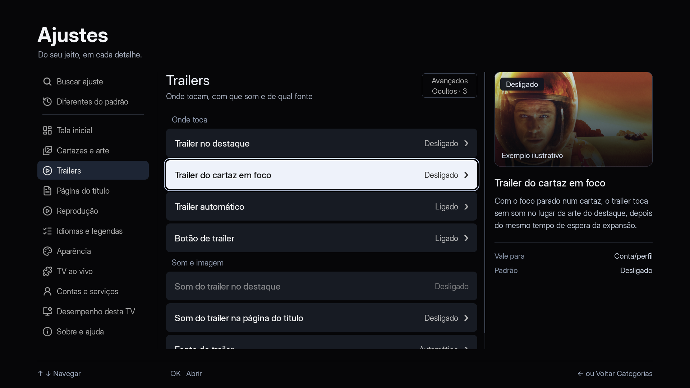
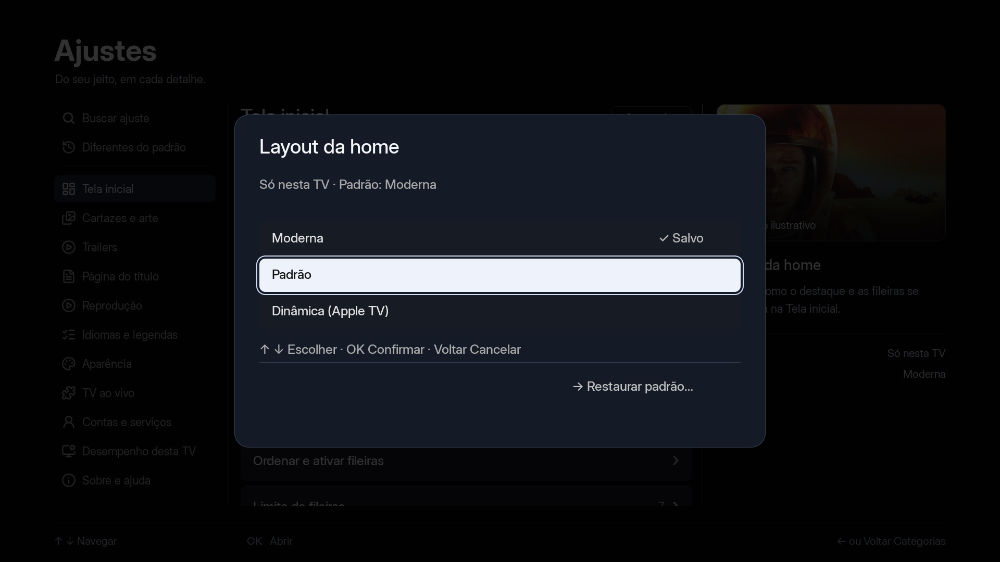

# Revisão dos Ajustes nativos — 02/10/2026

Implementação em C/SDL/OpenGL no worktree `agente/ajustesux`, sobre o merge
`2ab3ccc8`. Capturas de host em 1920×1080, com Inter e fixtures locais.
Nenhuma conta conectada. Não são fotos nem testes de uma TV física.

## Referência visual

O [mockup aprovado como direção](../../prototypes/ajustes-ux/preview.png)
guia a composição. A revisão nativa recupera a hierarquia tipográfica, o
foco com contorno, as superfícies azuladas, a imagem no alto do inspetor e o
controle compacto de avançados. Mantém todas as 11 categorias do app.





## Estados para revisar

| Cena | Captura |
|---|---|
| Navegação por categoria | [Índice](indice.png) |
| Opção selecionada | [Tela inicial](tela-inicial.png) |
| Categoria do mockup | [Trailers](trailers.png) |
| Escolha cancelável | [Seletor](seletor.png) · [Trailer](trailer-seletor.png) |
| Dependência sem alteração automática | [Requisito](dependencia.png) |
| Valores diferentes de fábrica | [Diferenças](diferencas.png) |
| Confirmação com Cancelar em foco | [Restaurar](restaurar.png) |
| Opção avançada revelada | [Avançados](avancados.png) |
| Edição numérica | [Número](numero.png) |
| Foco no controle de avançados | [Cabeçalho](cabecalho.png) |
| Texto em inglês | [English](english.png) |
| Barra lateral fixa | [Barra fixa](barra-fixa.png) |

A arte é a mesma amostra local do protótipo, identificada como ilustrativa.
Não representa reprodução nem prévia da Home real. O vermelho da restauração
é a cor de realce escolhida na fixture; não é um novo código de erro.

## Verificação

Nesta revisão passaram `ajustes_ux_dados.sh`, `ajustes_ux_interacao.sh`,
`ajustes_secoes.sh`, `i18n.sh`, `spotlight_shot.sh` e as capturas GL. A integração
anterior também passou padrões, perfis, modo seguro, idioma em disco, fonte da
interface e fonte de trailer. Esses resultados são locais.

Os testes cobrem busca sem credenciais, alcance por valor, padrão imutável,
rascunho/OK/Voltar, restauração individual, falha de escrita, mudança concorrente,
dependência, retorno à consulta com o mesmo foco e ausência de histórico da
busca dedicada. As tabelas de 28 idiomas estão alinhadas; novos textos têm
EN/ES, com fallback nos idiomas ainda sem revisão linguística.

Uma primeira execução do novo teste de interação escreveu o marcador
`ajustes-locais.txt` na instalação do Mac. O teste foi corrigido para definir
`NUVIO_DADOS`, verificar o diretório efetivo e isolar as execuções seguintes.
Não foi presumido nem apagado o conteúdo anterior desse marcador.

Para reproduzir as capturas, na raiz do worktree:

```bash
NUVIO_AJUSTES_UX=1 bash tests/ajustes_shot.sh /tmp/nuvio-ajustes-revisao
```

Ainda faltam avaliação em TVs/controles físicos, acessibilidade semântica e
medição de cadência, latência e memória. Prévia real com prazo, presets de
desempenho, ilha e otimizações de render são propostas posteriores, detalhadas
na [direção de UX](../../ux-direcao.md).
