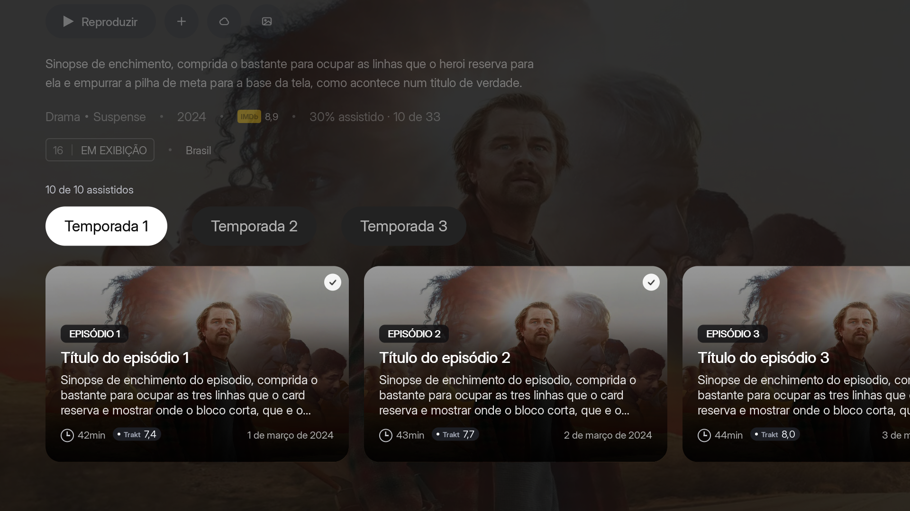
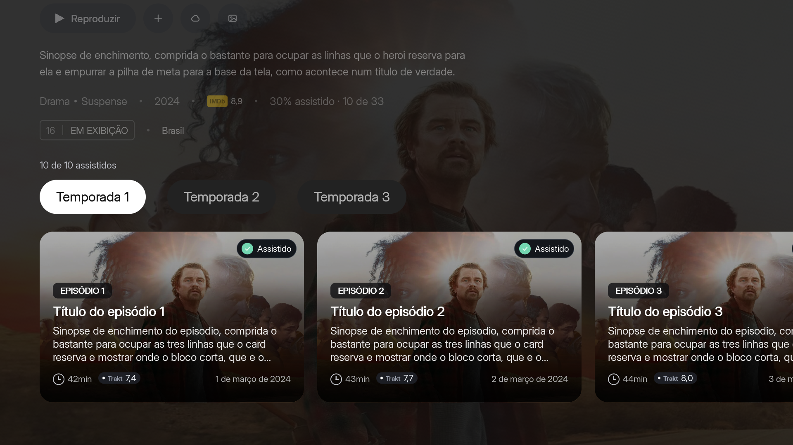
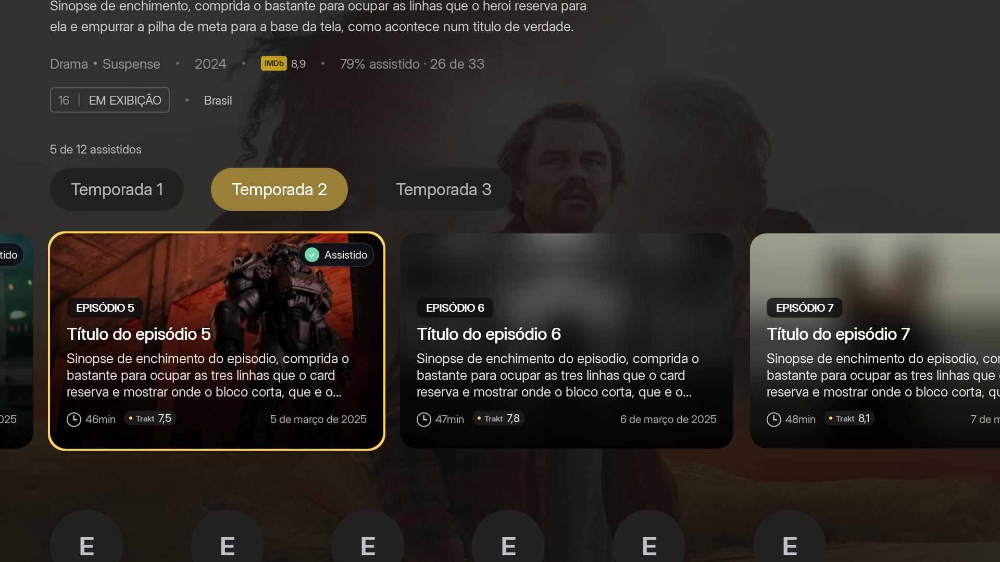

# Episódios assistidos — revisão visual

O círculo isolado foi substituído por um selo compacto “Assistido”, com círculo jade, check branco, texto branco, cápsula escura arredondada e contorno discreto, conforme o mockup aprovado. A lavagem da miniatura caiu de 22% para 12%, preservando mais da arte. O foco continua no contorno da miniatura.

O estado usa a mesma fonte de histórico do menu; histórico desconhecido não recebe selo. O texto utiliza a tradução existente e limita a largura do selo. Não há alteração na persistência ou navegação.

## Comparação

## Verificação

- `bash tests/detail_eps.sh`: passou.
- `bash tests/detail_eps_shot.sh /tmp/nuvio-episodios-jade`: execução concluída, capturas dos estados de histórico, foco, temporadas, episódios futuros e desfoque.
- `python3 tools/varredura-i18n.py`: nenhuma ocorrência sem tradução.
- `git diff --check`: passou.

Capturas do renderer nativo no host com dados de teste. A aparência e o desempenho em TV física ainda precisam ser conferidos.
